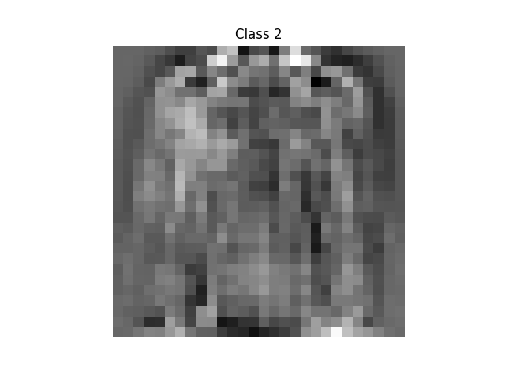

# Clothing Classifier
## Softmax Regression

This project implements Softmax Regression to classify images from the Fashion MNIST dataset. The softmax regression model uses stochastic gradient descent (SGD) to minimize the L2-regularized cross-entropy loss and classify images into one of 10 categories, such as shoes, t-shirts, and dresses. The project involves training the model, monitoring the loss during training, evaluating accuracy on a test set, and visualizing the learned weight vectors.

Each training and test example is assigned to one of the following labels:

* Class 0: T-shirt/top  
* Class 1: Trouser  
* Class 2: Pullover  
* Class 3: Dress  
* Class 4: Coat  
* Class 5: Sandal  
* Class 6: Shirt  
* Class 7: Sneaker  
* Class 8: Bag  
* Class 9: Ankle boot

## Accuracy

Once the model has been trained on the training set, its accuracy is evaluated on the test set. The percent correctly classified images (PC accuracy) is calculated and displayed. This indicates how well the model generalizes to unseen data.

- **Accuracy on Test Set**: `83.91%`

## Visualizing Trained Vectors

After optimizing the weights of the softmax regression model, the learned weight vectors for each class are visualized. Each weight vector represents the model’s learned features for the corresponding class and can be interpreted as an image. The following images visualize the trained weight vectors for the 10 different classes of the Fashion MNIST dataset.

| T-shirt/top | Trouser | Pullover | Dress |
|-------------|---------|----------|-------|
|  |  |  |  |

| Coat | Sandal | Shirt | Sneaker |
|------|--------|-------|---------|
|  |  |  |  |

| Bag | Ankle boot |
|-----|------------|
|  |  |

## Dependencies

This project requires the following Python libraries:

- `numpy`
- `matplotlib`

You can install them using pip:

```bash
pip install numpy matplotlib
```

## Run Instructions
Run the main script to train and evaluate the model:  
```bash
python clothing.py
```
